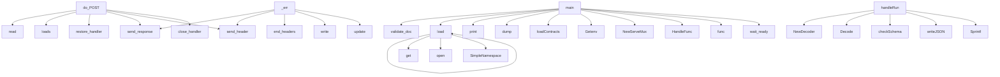

# System Architecture Analysis
<!-- generated in 0.00s -->

## Overview

- **Project**: /home/tom/github/if-uri/urirun-contract-windowpair
- **Primary Language**: python
- **Languages**: python: 9, yaml: 4, shell: 3, json: 1, yml: 1
- **Analysis Mode**: static
- **Total Functions**: 28
- **Total Classes**: 2
- **Modules**: 24
- **Entry Points**: 15

## Architecture by Module

### packages.consumer-go.service
- **Functions**: 7
- **File**: `service.go`

### packages.consumer.service
- **Functions**: 5
- **Classes**: 1
- **File**: `service.py`

### packages.producer.service
- **Functions**: 4
- **Classes**: 1
- **File**: `service.py`

### ci.nl_to_contract
- **Functions**: 4
- **File**: `nl_to_contract.py`

### orchestrator.drive
- **Functions**: 4
- **File**: `drive.py`

### src.handlers_generated
- **Functions**: 2
- **File**: `handlers_generated.py`

### toolkit.contracts_io
- **Functions**: 1
- **File**: `contracts_io.py`

### ci.emit_handlers
- **Functions**: 1
- **File**: `emit_handlers.py`

## Key Entry Points

Main execution flows into the system:

### packages.consumer.service.Handler.do_POST
- **Calls**: self.rfile.read, json.loads, packages.consumer.service.restore_handler, self.send_response, self.send_header, self.end_headers, self.wfile.write, int

### packages.producer.service.Handler.do_POST
- **Calls**: self.rfile.read, json.loads, packages.producer.service.close_handler, self.send_response, self.send_header, self.end_headers, self.wfile.write, int

### ci.nl_to_contract.main
- **Calls**: ci.nl_to_contract.validate_doc, json.load, print, print, json.dump, print, open, ci.nl_to_contract._mock

### packages.consumer-go.service.main
- **Calls**: packages.consumer-go.service.loadContracts, packages.consumer-go.service.Getenv, packages.consumer-go.service.NewServeMux, packages.consumer-go.service.HandleFunc, packages.consumer-go.service.func, packages.consumer-go.service.writeJSON, packages.consumer-go.service.Printf, packages.consumer-go.service.ListenAndServe

### toolkit.contracts_io.load
- **Calls**: json.load, os.environ.get, open, SimpleNamespace, SimpleNamespace, None.items, doc.get, c.get

### packages.consumer.service.Handler._err
- **Calls**: self.send_response, self.send_header, self.end_headers, self.wfile.write, body.update, None.encode, json.dumps

### packages.consumer-go.service.handleRun
- **Calls**: packages.consumer-go.service.NewDecoder, packages.consumer-go.service.Decode, packages.consumer-go.service.checkSchema, packages.consumer-go.service.writeJSON, packages.consumer-go.service.Sprintf, packages.consumer-go.service.restoreHandler

### orchestrator.drive.main
- **Calls**: orchestrator.drive.wait_ready, orchestrator.drive.wait_ready, orchestrator.drive._run_pair, orchestrator.drive.wait_ready, orchestrator.drive._run_pair, print

### packages.consumer.service.Handler.do_GET
- **Calls**: self.send_response, self.send_header, self.end_headers, self.wfile.write

### packages.producer.service.Handler.do_GET
- **Calls**: self.send_response, self.send_header, self.end_headers, self.wfile.write

### src.handlers_generated.close
> WYGENEROWANE Z KONTRAKTU v1. Sygnatura i kształt koperty pochodzą z
contracts.json — NIE edytuj ich ręcznie (build odrzuci dryf). Uzupełnij tylko ciał
- **Calls**: conn.handler, NotImplementedError, _ok

### src.handlers_generated.restore
> WYGENEROWANE Z KONTRAKTU v1. Sygnatura i kształt koperty pochodzą z
contracts.json — NIE edytuj ich ręcznie (build odrzuci dryf). Uzupełnij tylko ciał
- **Calls**: conn.handler, NotImplementedError, _ok

### ci.emit_handlers.emit
- **Calls**: _load_contracts_json, emit_py_module

### packages.consumer.service.Handler.log_message

### packages.producer.service.Handler.log_message

## Process Flows

Key execution flows identified:

### Flow 1: do_POST
```
do_POST [packages.consumer.service.Handler]
  └─ →> restore_handler
```

### Flow 2: main
```
main [ci.nl_to_contract]
  └─> validate_doc
```

### Flow 3: load
```
load [toolkit.contracts_io]
```

### Flow 4: _err
```
_err [packages.consumer.service.Handler]
```

### Flow 5: handleRun
```
handleRun [packages.consumer-go.service]
```

### Flow 6: do_GET
```
do_GET [packages.consumer.service.Handler]
```

### Flow 7: close
```
close [src.handlers_generated]
```

### Flow 8: restore
```
restore [src.handlers_generated]
```

### Flow 9: emit
```
emit [ci.emit_handlers]
```

### Flow 10: log_message
```
log_message [packages.consumer.service.Handler]
```

## Key Classes

### packages.consumer.service.Handler
- **Methods**: 4
- **Key Methods**: packages.consumer.service.Handler.log_message, packages.consumer.service.Handler._err, packages.consumer.service.Handler.do_GET, packages.consumer.service.Handler.do_POST
- **Inherits**: BaseHTTPRequestHandler

### packages.producer.service.Handler
- **Methods**: 3
- **Key Methods**: packages.producer.service.Handler.log_message, packages.producer.service.Handler.do_GET, packages.producer.service.Handler.do_POST
- **Inherits**: BaseHTTPRequestHandler

## Data Transformation Functions

Key functions that process and transform data:

### ci.nl_to_contract.validate_doc
> Brama: ta sama logika konformansu co reszta systemu, na surowym dokumencie z LLM.
- **Output to**: doc.get, C.items, c.get, enumerate, problems.append

## Public API Surface

Functions exposed as public API (no underscore prefix):

- `packages.consumer.service.Handler.do_POST` - 20 calls
- `packages.producer.service.Handler.do_POST` - 19 calls
- `ci.nl_to_contract.validate_doc` - 19 calls
- `ci.nl_to_contract.main` - 17 calls
- `packages.consumer-go.service.main` - 10 calls
- `packages.consumer-go.service.loadContracts` - 9 calls
- `packages.consumer-go.service.checkSchema` - 8 calls
- `toolkit.contracts_io.load` - 8 calls
- `packages.consumer-go.service.handleRun` - 6 calls
- `ci.nl_to_contract.ask_llm` - 6 calls
- `orchestrator.drive.post` - 6 calls
- `orchestrator.drive.main` - 6 calls
- `packages.consumer-go.service.writeJSON` - 5 calls
- `packages.consumer.service.Handler.do_GET` - 4 calls
- `packages.producer.service.Handler.do_GET` - 4 calls
- `orchestrator.drive.wait_ready` - 4 calls
- `src.handlers_generated.close` - 3 calls
- `src.handlers_generated.restore` - 3 calls
- `packages.consumer.service.restore_handler` - 2 calls
- `packages.consumer-go.service.restoreHandler` - 2 calls
- `ci.emit_handlers.emit` - 2 calls
- `packages.consumer-go.service.typeOK` - 1 calls
- `packages.consumer.service.Handler.log_message` - 0 calls
- `packages.producer.service.close_handler` - 0 calls
- `packages.producer.service.Handler.log_message` - 0 calls

## System Interactions

How components interact:



## Reverse Engineering Guidelines

1. **Entry Points**: Start analysis from the entry points listed above
2. **Core Logic**: Focus on classes with many methods
3. **Data Flow**: Follow data transformation functions
4. **Process Flows**: Use the flow diagrams for execution paths
5. **API Surface**: Public API functions reveal the interface

## Context for LLM

Maintain the identified architectural patterns and public API surface when suggesting changes.